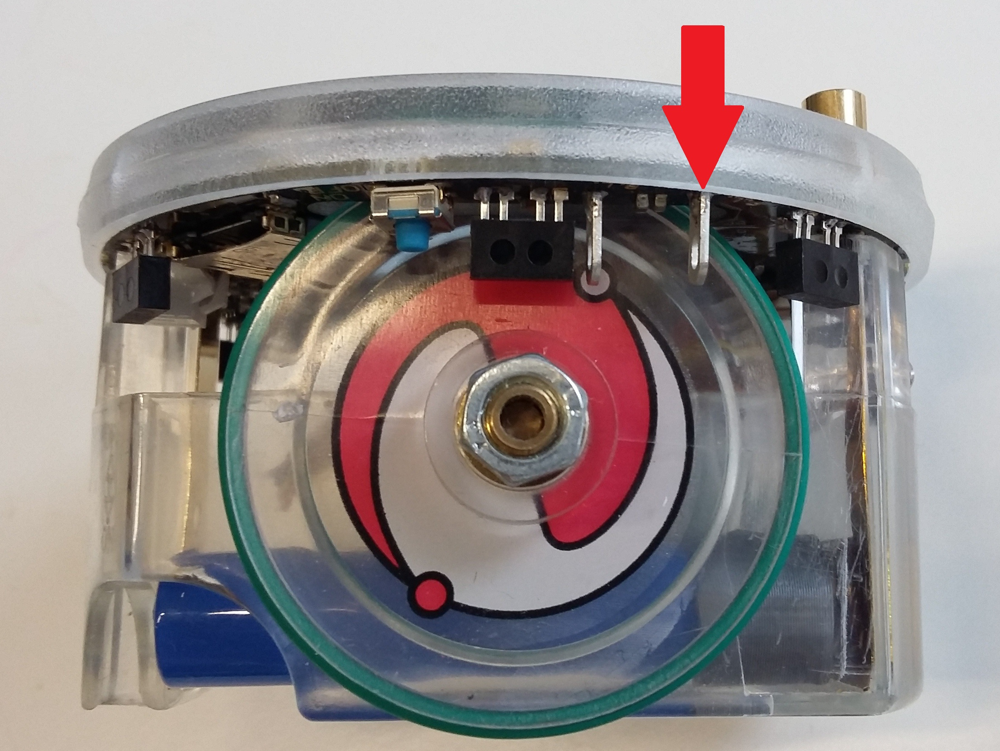

# Introduction
- Welcome in the very first lab of MICRO-315
- `Goal`: learn how to program and debug the e-puck2 robot and familiarize with the STM32F4 microcontroller family and Git
- `⏱ Duration`: 4 hours

## Goals
- This practical work shows all the necessary steps to program the e-puck2 miniature mobile robot in C, using the standard library provided by ST.
- The main goal is to gain knowledge of the STM32F4 microcontroller and refresh some concepts about peripherals such as GPIOs and TIMERs.
- The second goal and not the least is to present the tools that will be used throughought every labs of this semester

## Methodology
To achieve the main goal, we will go through the following steps:
  - Installing and getting familiar with the IDE (Integrated Development Environment): [Part 1](#part-1---integrated-development-environment-ide)
  - Getting familiar with e-puck2 robot: [Part 2](#part-2---presenting-the-epuck2-robot)
  - Understand the basic of the version control tool *Git*, *MANDATORY* for this course: [Part 3](#part-3---git-introduction)
  - Setup the git repository for your group: [Part 4](#part-4---setting-up-your-group-tps-repository)
  - Getting used to program an e-puck2: use the on board debugger interface for programming and debugging [Part 5](#part-5---tutorial-for-programming-the-epuck2-robot)
  - Writing a first LED blinking program, first with *NOP* loops, then using timers
  - Change the LED's blinking sequence using the selector
  
# Part 1 - Integrated Development Environment (IDE)
Click on one the links accordingly to your computer's configuration
- 👉 [❖ Windows](https://github.com/EPFL-MICRO-315/TPs-Student/wiki/Installing-the-IDE-%E2%9D%96-Windows)
- 👉 [🍎 MacOS](https://github.com/EPFL-MICRO-315/TPs-Student/wiki/Installing-the-IDE-%F0%9F%8D%8E-MacOS)
- 👉 [🐧 Linux](https://github.com/EPFL-MICRO-315/TPs-Student/wiki/Installing-the-IDE-%F0%9F%90%A7-Linux)

The IDE now freshly installed, let's start by quickly presenting the IDE which we will use throuhought the semester.
- 👉 [🛠 Tools](https://github.com/EPFL-MICRO-315/TPs-Student/wiki/IDE-%F0%9F%9B%A0-Tools)
- 👉 [🗔 User Interface](https://github.com/EPFL-MICRO-315/TPs-Student/wiki/IDE-%F0%9F%97%94-User-Interface)

# Part 2 - Presenting the EPuck2 robot
- 👉 [Presenting the EPuck2](https://github.com/EPFL-MICRO-315/TPs-Student/wiki/EPuck2-Presenting-the-EPuck2)
- 👉 [Testing the EPuck2](https://github.com/EPFL-MICRO-315/TPs-Student/wiki/EPuck2-Testing-the-EPuck2)

# Part 3 - Git introduction
- 👉 [Introduction to Git](https://github.com/EPFL-MICRO-315/TPs-Student/wiki/Git-Introduction-to-Git)

# Part 4 - Setting up your group TP's repository
- Click 👉 [here](https://github.com/EPFL-MICRO-315/TPs-Student/wiki/Git-Setting-up-git-for-TPs) to set up git for the TPs
- Click 👉 [here](https://github.com/EPFL-MICRO-315/TPs-Student/wiki/Git-Working-in-groups) to learn how to work in group using Git
- Click 👉 [here](https://github.com/EPFL-MICRO-315/TPs-Student/wiki/Git-Asking-for-support) to check how to ask for support

# Part 5 - Tutorial for programming the EPuck2 robot
## 5.0 🔌 Preparation 
- Open the folder TPs with VSCode Epuck2
- Make sure you are in the right branch (TP1_Exercise), if not you must do a **git checkout TP1_Exercise**
- Run the task `Link Library ST to workspace`

## 5.1 🔨 Building the Project
- Building the code consists of compiling the **\*.c** and **\*.s** files to create object files, **\*.o**, and then linking the object files to create the **blinky.elf** file
- More detail on the steps of the build process will be given during TP2
- The generated **.elf** file contains the data necessary to program the device and additional information that lets you debug at the source code level
- The additional files **.list**, **.size** and **.mem** are generated containing the disassembly output and the memory layout table with symbol address and size.
- 👉 To compile the project
  1. Run the task **Make TP1**
  2. Observe the progress of the compilation in the Build Console tabular (as in Listing 1).
  3. When Done is displayed, your code is built and you are ready to program the device. If there are errors in your code, they will be displayed in this console.
      ```yml
      > Compiling gpio.c
      > Compiling main.c   
      ar> Compiling timer.c
      m-none-eabi> Compiling stm32f4xx_ll_rcc.c
      -gcc > Compiling system_clock_config.c
      -c -mcpu=cortex-m4 -O0 -ggdb -fomit-frame-pointer -falign-functions=16 -ffunction-sections -fdata-sections -fno-common -Wall -Wextra -Wundef -Wstrict-prototypes -DSTM32F4 -DSTM32F407xx -mthumb -mno-thumb-interwork -MD -MP -I. -I../ST gpio.c -o gpio.o
      > Compiling system_stm32f4xx.c   
      > Compiling startup_stm32f407xx.s
      arm-none-eabi-gcc -c -mcpu=cortex-m4 -O0 -ggdb -fomit-frame-pointer -falign-functions=16 -ffunction-sections -fdata-sections -fno-common -Wall -Wextra -Wundef -Wstrict-prototypes -DSTM32F4 -DSTM32F407xx -mthumb -mno-thumb-interwork -MD -MP -I. -I../ST main.c -o main.o
      arm-none-eabi-gcc -c -mcpu=cortex-m4 -O0 -ggdb -fomit-frame-pointer -falign-functions=16 -ffunction-sections -fdata-sections -fno-common -Wall -Wextra -Wundef -Wstrict-prototypes -DSTM32F4 -DSTM32F407xx -mthumb -mno-thumb-interwork -MD -MP -I. -I../ST timer.c -o timer.o
      arm-none-eabi-gcc -c -mcpu=cortex-m4 -O0 -ggdb -fomit-frame-pointer -falign-functions=16 -ffunction-sections -fdata-sections -fno-common -Wall -Wextra -Wundef -Wstrict-prototypes -DSTM32F4 -DSTM32F407xx -mthumb -mno-thumb-interwork -MD -MP -I. -I../ST ../ST/system_clock_config.c -o ../ST/system_clock_config.o
      arm-none-eabi-gcc -c -mcpu=cortex-m4 -O0 -ggdb -fomit-frame-pointer -falign-functions=16 -ffunction-sections -fdata-sections -fno-common -Wall -Wextra -Wundef -Wstrict-prototypes -DSTM32F4 -DSTM32F407xx -mthumb -mno-thumb-interwork -MD -MP -I. -I../ST ../ST/stm32f4xx_ll_rcc.c -o ../ST/stm32f4xx_ll_rcc.o
      arm-none-eabi-gcc -c -mcpu=cortex-m4 -O0 -ggdb -fomit-frame-pointer -falign-functions=16 -ffunction-sections -fdata-sections -fno-common -Wall -Wextra -Wundef -Wstrict-prototypes -DSTM32F4 -DSTM32F407xx -mthumb -mno-thumb-interwork -MD -MP -I. -I../ST ../ST/system_stm32f4xx.c -o ../ST/system_stm32f4xx.o
      arm-none-eabi-gcc -x assembler-with-cpp -c -mcpu=cortex-m4 -mthumb -mno-thumb-interwork -I. -I../ST ../ST/startup_stm32f407xx.s -o ../ST/startup_stm32f407xx.o
      > Linking blinky.elf
      arm-none-eabi-gcc main.o gpio.o timer.o ../ST/system_clock_config.o ../ST/stm32f4xx_ll_rcc.o ../ST/system_stm32f4xx.o ../ST/startup_stm32f407xx.o   -mcpu=cortex-m4 -O0 -ggdb -fomit-frame-pointer -falign-functions=16 -ffunction-sections -fdata-sections -fno-common -nostartfiles -L./ -mthumb -mno-thumb-interwork -Wl,--no-warn-mismatch,--gc-sections,--script=../ST/STM32F407VGTx_FLASH.ld  -o blinky.elf
      > Creating blinky.mem
      > Creating blinky.list
      > Creating blinky.size
      arm-none-eabi-nm --numeric-sort --print-size blinky.elf > blinky.mem
      arm-none-eabi-objdump -d blinky.elf > blinky.list
      arm-none-eabi-nm --size-sort --print-size blinky.elf > blinky.size
      arm-none-eabi-size blinky.elf
         text    data     bss     dec     hex filename
         1432       4    1540    2976     ba0 blinky.elf
      > Done
      ```
  > `Home Task 1`<br>
  > Try to find out the meaning of the words **text**, **data**, **bss**, **dec**.<br>
  > Estimate the size of your code in percentage of total Flash and RAM available with this microcontroller.

## 5.2 🐞 Programming and debugging the EPuck2 robot
- Now that you have built your code and created an **.elf** file that can be loaded on the microcontroller, you can program the device:
  - Plug the USB cable (no need to turn on the e-puck2 using the dedicated button since the programmer MCU will automatically power the main MCU) 
  - Specify the port to which the EPuck2's gdb-server is connected, click 👉 [here](https://github.com/EPFL-MICRO-315/TPs-Student/wiki/EPuck2-Presenting-the-EPuck2#identify-the-ports) for more info
  - Program the EPuck2 by clicking on `Run and Debug`
- 💡 click 👉 [here](https://github.com/EPFL-MICRO-315/TPs-Student/wiki/IDE-%F0%9F%90%9B-Debugging) for more info about programming and debugging


# Part 6 - STM32F4 Microcontroller and GPIO configuration
- First read up to the end of those 2 documentation pages
  - click 👉 [Presenting the STM32](https://github.com/EPFL-MICRO-315/TPs-Student/wiki/STM32-Presenting-the-STM32)
  - click 👉 [STM32 GPIO](https://github.com/EPFL-MICRO-315/TPs-Student/wiki/STM32-GPIO)

## 6.1 Blink a LED automatically
> `Task 1`
>- Use a simple delay function to make **LED7** blink in a while loop at 1 Hz
>- Hints:
>   - Consult the electrical schema of the e-puck2 to find the **LED7** IO pin
>   - Use the functions declared in *TP1_blinky/blinky/gpio.c* to modify the state of the pin on which the LED is connected, and create a function that generate a time delay using assembly nop instructions
- 💡 keep in mind it is possible to watch the stgate of the register when the code is running in the EPuck2 !

## 6.2 Blink only the Front LED
> `Task 2`
>- Modify your code to blink only the 5mm red **FRONT_LED**
>- Hints:
>    - Consult the electrical schema of the e-puck2 to find the **FRONT_LED** IO pin
>    - If the LED doesn’t blink, compare the LED driving topology with the previous one and try to play with the **PUPDR** and **OTYPER** GPIO registers from the EmbSys Registers tabular
>    - Use the oscilloscope to measure the voltage level on the FRONT_LED test point, under the marked **FL** on the transparent cover (see below)
>    - 💡 **You can connect the GND to the screw that holds the cover**
>    - Describe the influence of both registers and try to explain the situation
>    - Adapt your code for this Output topology
>    - Take the opportunity to use the oscilloscope to measure the influence of 2 extreme values of **OSPEEDR** configuration for this GPIO and take a plot of both for rising and falling edges
<p float="left">
  
</p>
- 💡 Don’t forget to pause the debugger to be able to change the register value from the EmbSys Registers

## 6.3 Blink only the 4 Body LEDs
> `Task 3`
>- Modify your code to blink only the 4 green **BODY_LEDs**
>- Hints:
>   - Consult the electrical schema of the e-puck2 to find the **BODY_LED** IO pin
>   - If the LEDs don’t blink, check in detail all characteristics of this GPIO (port, pins, topology)
>   - Can you explain why this output topology is used for **BODY_LED** and not the same than the **LED7** one for example?

## 6.4 Blink many LEDs automatically with a circular pattern
> `Task 4`
>- Blink the **LED1** → **LED3** → **LED5** → **LED7** with the following circular pattern sequence depending on the Selector state:
>    - ON1→ON3→ON5→ON7→OFF1→OFF3→OFF5→OFF7 or
>    - ON1→OFF1→ON3→OFF3→ON5→OFF5→ON7→OFF7
>- Hints:
>    - Consult the electrical schema of the e-puck2 to find the **LED1**, **LED3**, **LED5** and the **Selector** IO pins
>    - Create a function that returns the Selector states
>        - You must obviously configure the correct pins in the correct way to be able to read the Selector state
>        - You can then visualize the state of the Selector by looking at the IDR register of the related pins with the register tab when debugging
>    - Have a look on the comment close to the selector on the schema, can you explain it?
>    - Define different LED sequences depending on the Selector state
- 💡 The e-puck2 is equipped with a selector that you can use to configure different modes
  <p float="left">
    
  </p>

# Part 7 - Timer Interrupt Tutorial
- In this section, you will use a timer to make the LED blink instead of using a while loop as you did in the previous exercise
- To do so, we ask you to configure the timer **TIM7** to periodically count up and, when it reaches the value set in the **ARR** register, to update the counter with a reload value and generate an interrupt
- It is then in the interrupt routine generated by the timer that you will have to change the state of the LED.
- First read through all this documentation page
  - click 👉 [here](https://github.com/EPFL-MICRO-315/TPs-Student/wiki/STM32-Timer)
- The configuration of the timer will be done in the file *TP1_blinky/blinky/timer.c*

## 7.1 Configure TIM7 to have interrupts at 1Hz
> `Task 5`
>- Look through the chapter 20 *Basic timers (TIM6 and TIM7)* in the Reference Manual to understand how to configure the **TIM7** timer
>- Configure **TIM7** for an interrupt frequency of 1Hz
>- Choose the correct timer prescaler **PSC** and reload value **ARR**
>- Hint:
>    - Find out the frequency of the bus on which the TIM7 is connected and deduce the frequency of the timer

## 7.2 Interrupt routine
- Now, when the timer update event triggers the interrupt, the execution of the main program is halted
- the processor's registers are saved on the stack and the processor's execution jumps to the corresponding address in the interrupt vector table
- When the ISR returns, the processor's registers are restored and the execution of the main program continues.
- In the timer interrupt you have to manually clear the update interrupt flag **UIF** in the timer status register **SR** (see *TIM6/TIM7* status register (TIMx_SR)* Reference Manual page 708)

## 7.3 Toggle LED7 with TIM7 at 1Hz
> `Task 6`
>- Write a code that toggles the LED 7 of the e-puck2 robot using timer 7 implemented in the file *timer.c*
>- Hint:
>    - Include the *timer.h* header in the *main.c* file
