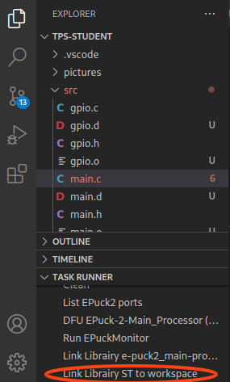
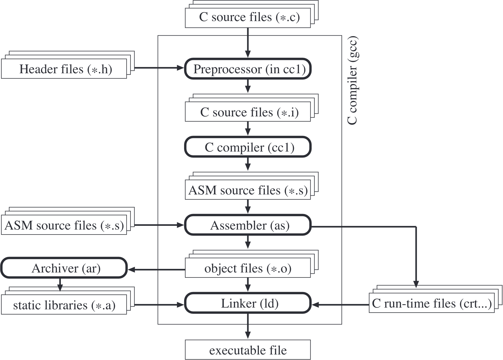
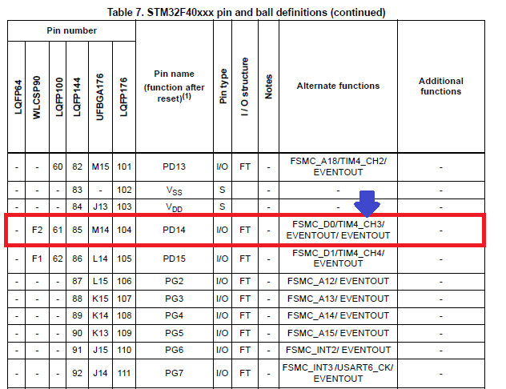
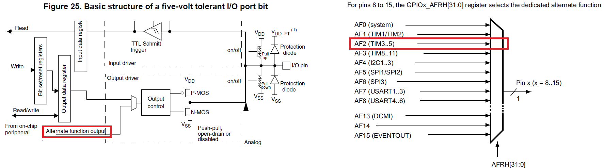
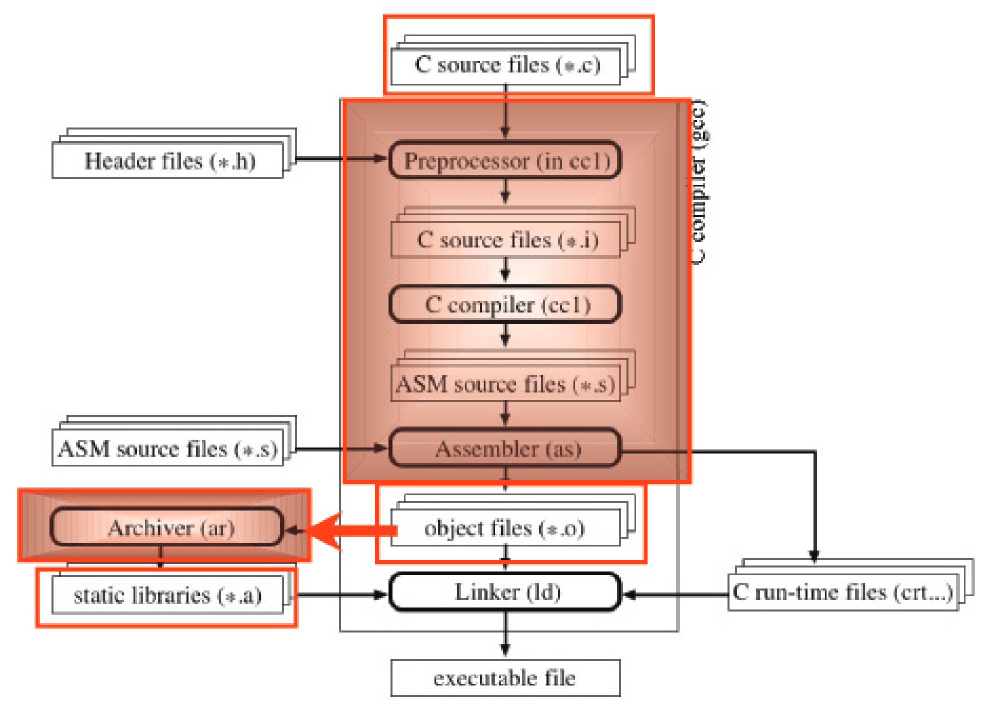

# Introduction
- Welcome in the lab 2 of MICRO-315
- `Goal`: Getting in touch with the gcc compiler and programming a motor control library for the e-puck2 miniature mobile robot
- `⏱ Duration`: 4 hours

## Goals
- You will see the compiling process in detail as you have learned during the lecture
- The rest of this exercise shows all necessary steps to generate a low-level library for the e-puck2 miniature mobile robot written in C
- The library targeted in this exercise is a motor control library allowing to set speed and position targets.
- 💡 All the documentation concerning the GNU embedded toolchain for ARM processors **arm-none-eabi** and the compiler GCC can be found in the subfolder **installpath/EPuck2Tools/gcc-arm-none-eabi-7-2017-q4-major/share/doc/gcc-arm-none-eabi/pdf**

## Methodology
To achieve the main goal, we will go through the following steps:
- Understanding some basic features of the compiler.
- Understanding how a PWM works.
- Understanding how a stepper motor works and programming a stepper motor controller in C.
- Making a library out of it.

## ⚠ TODO before starting the Lab
- execute the command `git checkout reference/TP2_Exercise`
  - all the files related to this lab should now be downloaded in your Workplace folder
- Create a symbolic link to the ST library (won't compile otherwise) by running the `Link Library ST to workspace` task
    <p float="left">
        
    </p>

# Part 1 - C Compiler
To understand how the code is generated, it is important to understand how the compiler works. The main compilation steps are summarized in [figure 1](#figure-1). In this first exercise we will explore this architecture experimentally.
>### Figure 1
>Compilation steps in GCC
    <p float="left">
      
    </p>


## 1.1 Generated code
- Create a new folder src under Workplace/TPs and create in it a file named **test.c**
- copy the [following code](#code-block-1) in it:
    >### Code block 1
    >```c
    >int main()
    >{
    >    int i, j, out = 0;
    >    for(i=0; i < 10; i++)
    >        for(j = 0; j < 10; j++)
    >            out += i + j;
    >    return out;
    >}
    >```
- Now open a terminal using VSCode EPuck2: `Ctrl` + `Shift` + `P` and then type and execute `View: Toggle Terminal`
- in the terminal, **cd** in the folder **Workplace/TPs/src**
  - 💡 executing `ls` or `dir` will display the content of the current folder, verify that **test.c** is there
- During the first practical, your code was compiled using the GNU toolchain for ARM processor through the VSCode task `Make ST`
  - this task was executing a Makefile itself executing GNU toolchain for ARM processor executables
- We will now compile the code using only the command line, in order to see the compilation process in detail. This is the standard and basic way to compile a program
- The command to compile the C code and generate an object files and all the intermediate steps is :
  ```sh
  arm-none-eabi-gcc -save-temps=obj -mcpu=cortex-m4 -c test.c -o test.o
  ```
  - **arm-none-eabi-gcc** is the command to launch the compiler
  - **-save-temps=obj** is used to save the intermediate files of the compilation process
  - **-mcpu=cortex-m4** is called to specify the processor that will execute the code
  - **-c** specifies to not do the linking step
- Compile the test.c file using the explained command in the terminal
- When executing the command, the shell searchs for an executable named arm-none-eabi-gcc in the folder specified in the **PATH** variables
  - executing the command in the VSCode EPuck2 internal terminal should not run in errors
    - in fact, this terminal was configured to add the arm-none-eabi toolchain to the **PATH** variables
  - ⚠ however executing this command from any other terminal might lead to errors:
    ```
    arm-none-eabi-gcc -save-temps=obj -mcpu=cortex-m4 -c test.c -o test.o

    'arm-none-eabi-gcc' is not recognized as an internal or external command, an executable program or a batch file.
    ```
    - This error occurs because the command line instance doesn't know yet what is this command
    - We have to add the path to the folder containing the executable files in the **PATH** environment variable
    - the **PATH** variable is used to store the location of all the known executables the command line can call
    - Type the following command (a bit different depending on the OS) to add the path of the ARM toolchain
      >### set PATH for Windows
      ```
      set PATH=installpath/EPuck2Tools/gcc-arm-none-eabi-7-2017-q4-major/bins;%PATH%
      ```
      >### set PATH for MacOS and Linux
      ```
      export PATH=installpath/EPuck2Tools/gcc-arm-none-eabi-7-2017-q4-major/bin:$PATH
      ```
    - ⚠ the exact path to the gcc-arm-none-eabi toolchain might depend on your installation
    - ⚠ This procedure is temporary, it applies only to this current existing command line window
    - You will have to set again the **PATH** variable if you open a new command line window
    - 🚀 Now the compilation command should execute correctly


> `Task 1`
>- Look at the files generated by the compilation
>- Which files have been generated?
>- Which file is generated from which step of the compiler?

> `Task 2`
>- Look in detail at the assembler code generated by the compiler. Understand the assembly language instructions by using the [Cortex-M4 Generic User Guide](https://github.com/EPFL-MICRO-315/TPs-Student/wiki/datasheets/Cortex-M4-generic-user-guide.pdf)
>- Hints:
>    - Look in particular at the functionality of the instructions **push**, **pop**, **mov**, **add**, **str**, **ldr**, **cmp** and **ble**
>    - What is the purpose of **sub sp, sp, #20** instruction at the beginning of the main function?
>    - Try to initialize more variables in the main function and see how this instruction will change

> `Task 3`
> - Remember the role of the instruction **#define** in C
> - Which step of compilation takes in charge this instruction?
> - To look at this aspect in a real example, create a source C file **.c** with the [following code](#code-block-2) in it
> - Then look at the **.i** file generated by the compilation

>### Code block 2
>```c
>#define PI      3.14
>#define CIRC(R) (2 * PI * R)
>int main()
>{
>    int circonference, rayon = 2;
>    circonference = CIRC(rayon);
>    return circonference;
>}
>```

## 1.2 Compilation process
> `Task 4`
> - Use the option **-v** to observe the detailed compilation process
> - Check the several steps and understand the main mechanisms
> - Verify that you can directly assemble assembler code with the following command:
>   - ```arm-none-eabi-as test.s -o test.o```

## 1.3 Compilation options
> `Task 5`
> - Change the compiling command (cursor up to repeat the last commands) and the content of the program to check the influence of some compilation options.
> - Check the warning option described in table [table 1](#table-1) on the code [code block 3](#code-block-3)
> - Describe the impact of these options and their use with the questions askedd in the table

>### Code block 3
>```c
>int main()
>{
>    int i, j, out = 0, k;
>    for(i = 0; i < 10; i++)
>        for(j = 0; j < 10; j++)
>            out += i + j;
>}
>```

>### Table 1
>| Option | Influence on compilation process | When is this option useful ? |
>|---|---|---|
>| -Wreturn-type | type answer here | ... |
>| -Wunused-variable | ... | ... |
>| -Wall | ... | ... |

> `Task 6`
>- Understand the compiling options described in table [table 2](#table-2) on the following [code block](#code-block-4):
>- Describe the influence of these options and when they are useful
>   - What is the impact on code size, use of memory, and execution speed?
>   - Compare the number of instructions necessary to execute a code with the different levels of optimization:
>     - no optimization: **-O0**
>     - optimization level 1: **-O1**
>     - optimization level 2: **-O2**
>     - optimization level 3: **-O3**
>- When could this type of optimization (**-O3** or **-funroll-loops**) generate big problems (imagine an embedded system with sensors and actuators)?
>- How can we force a correct optimization in this case?
>
>Hint: **-funroll-loops** only works when an optimization level is set (**-O1**, **-O2**, **-O3**)

>### Code block 4
>```c
>int main()
>{
>    int i, j, out = 0, k;
>    for(i = 0 ; i < 10; i++)
>        for(j = 0; j < 10; j++)
>          out += i + j;
>    return out;
>}
>```

>### Table 2
>| Option | Influence on compilation process | When is this option useful ? |
>|---|---|---|
>| -O0 | type answer here | ... |
>| -O1 | ... | ... |
>| -O2 | ... | ... |
>| -O3 | ... | ... |
>| -funroll-loops | ... | ... |
>| -funroll-loops -O3 | ... | ... |

# Part 2 - Programming a PWM signal to drive a LED
## 2.1 Introduction
- During TP1, you used a timer and an interrupt routine to toggle a LED with a given frequency
- Here, we are going to drive a LED using a PWM (Pulse Width Modulation) signal, which will allow us to change the visible intensity of the LED
- First read the wiki to learn more about the PWM configuration on STM32
  - Click 👉 [here](https://github.com/EPFL-MICRO-315/TPs-Student/wiki/STM32-PWM)

## 2.2 Configuration of the GPIO
- In this exercise, we will select the Pin 14 of the Port D: **PD14** that is connected to the channel 3 of the timer 4: **TIM4_CH3** as shown in the [**table 7 STM32F40xxx pin and ball definitions**](#figure-3)
- This GPIO is connected to the Front Led of the e-puck2 → it is perfect to test the effect of a PWM signal on the intensity of a LED!
>### Figure 3
>STM32F40xxx pin and ball definitions, from the datasheet
    <p float="left">
      
    </p>

>### Figure 4
>Configuration of the GPIO in alternate function mode, see Sec. 8 of the Reference Manual
    <p float="left">
      
    </p>

> `Task 7`
>- Create a function in **gpio.c** and **gpio.h** called **gpio_config_output_af_pushpull**
>- Use the Reference Manual to configure the pin in **Alternate Function (AF)** mode by changing bits in the **MODER** register

> `Task 8`
>- Use the Reference Manual to configure the register **AFR** to select the right alternate function for the pin 14 so that it is driven by the **Channel 3** of the **Timer 4**
>
>💡 Hints:
>   - Alternate function selection requires modifying bits in the **AFR** register of the **GPIOD**
>   - Consult the datasheet to get the **Alternate Function (AF)** number corresponding to the function and pin (or just at [this figure](#figure-4))
>   - Use this number in the reference manual (Sec 8.4.10) to identify how to set **AFRH14**


- The GPIO is now configured 🥇
- Now let's configure the **Timer4** and **Channel 3** to obtain the desired PWM on the pin 14
- The **Timer 4** should be configured similarly to what was done in Lab 1 with **Timer 6**
-💡 Look at the wiki on PWM to configure the timer

> `Task 9`
>- Determine the **Prescaler** and **Counter maximum** value for **Timer 4**
>- Hint:
>   - The blinking of the LED should be fast in order to not being seen
>   - Something around **80-100Hz**

- The final step: configure the **Channel 3** of **Timer4** for **Output Compare**

> `Task 10`
>- Configure the three registers of **TIM4**: **CCMR2**, **CCR3**, **CCER** in order to obtain the PWM signal on pin 14
>   - Use **PWM mode 1**
>- Build and run your code
>   - 💡 Remember there is debugger with register visualization to check register bits
>- You can use the selector to change the value of **CCR3** → change the apparent intensity of the Front LED
>- Use the oscilloscope to visualize the PWM signal with different duty cycle
>
>💡 Hint:
>- Take a look at the reference manual to learn how to configure the timer to use the PWM

# Part 3 - Programming a library to drive the stepper motor of the e-puck2
- First read the wiki to learn more about the EPuck2 Motors
  - Click 👉 [here](https://github.com/EPFL-MICRO-315/TPs-Student/wiki/EPuck2-Motor)

## 3.1 Functions implementation
- All the functions are already declared in **motor.c** and **motor.h**. What is asked is to complete them.
> `Task 11`
>- Make sure to be in the branch **TP2_Exercise**
>- Complete the necessary functions to control the two stepper motors in speed, direction or target position
>   - **identify** the pins of the MCU linked to the **H-bridges** controlling the left and right motors
>   - **look** at **motor.c** file in order to read the definitions of the functions to implement
>   - **write** a stepper motor driver for constant speed using timers **TIM6** and **TIM7** for the right and left motor using the timer interrupt to make one motor step
>   - Reuse the code of TP1 to help you in configuring the timers
>   - Use a timer frequency of about **100kHz**
>   - The speed will be given by the counter value you will assign to the **ARR** register
>   - The bigger **ARR** is, the slower the motor will turn
>   - Fordbid speed above 13cm/s
>   - add motor.c in the **makefile** on the line listing the .c files to be compiled
>- Hint: Test these functions with a simple demo that moves forward for 10 cm, turns 180 degrees, and comes back to the starting point

>⚠⚠ **It is important to set each phase of the motor to 0 when the robot does not have to move, or if the program is stopped, thus ensure that no phase is active continuously, otherwise you risk damaging the motors!** ⚠⚠

## 3.2 Library
- Compile your project again to be sure to have the **.o** files
- The idea here is in the file explorer window to move out of the project's folder the file **motor.c** but to let **motor.o** and **motor.h**
- In the Makefile delete the mention to **motor.c** and add **motor.o** to the variable **LIB_OBJS**
- Make sure the Makefile has been saved and you can now clean the project and recompile it.

> `Task 12`
>- The effect on the results at the execution is the same, but what is the difference from a developer point of view?
>- What are the advantages and disadvantages of this configuration?

- To understand how a library is generated, look at the figure [below](#figure-8)
>### Figure 8
>Path for the generation of a library
    <p float="left">
      
    </p>

- Now let's create a library archive which will contain **motor.o**, **gpio.o**, **timer.o** and **selector.o**:
  - Reopen the VSCode terminal (or open an external one and reconfigure the **PATH**)
  - Go to the directory containing the files of the projects (command **cd**) and type the following command:
  ```
  arm-none-eabi-ar -q libtp2.a gpio.o motor.o timer.o selector.o
  ```

- Now in the file explorer window, a **libtp2.a** file should have appeared
- Move out of the project's folder **motor.o**, **motor.c**, **gpio.o**, **gpio.c**, **timer.o**, **timer.c**, **selector.o** and **selector.h**
- Edit the **Makefile** and delete all the mention to these files (.c and .o) and add **libtp2.a** to the variable **LIBS**
- You should now be able to compile the project.

> `Task 13`
>- Do you see a difference?
>- What is the difference?
>- When do we use a library instead of simply object files?
>- Understand what **ar** is really doing by looking to its definition under https://en.wikipedia.org/wiki/Ar_(Unix)
>- 💡 Hint: If your program (that includes the library) doesn't work, it might be that you did a mistake in your library.