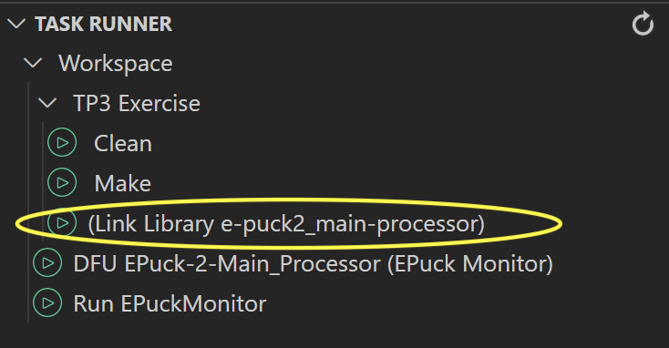

# Introduction
- Introduces the concept of a RTOS using ChibiOS as an example, utilization of the IMU
- ChibiOS: a RTOS optimized for the execution speed and the size of the code, it contains a lot of drivers to use the peripherals of the STM32 families
- `Goal`: Understand the RTOS main mechanisms and complete some functions to correct the offset of the IMU, convert the raw measurements into known units and turn on the leds depending on the orientation of the robot
- `⏱ Duration`: 4 hours

## ⚠ ToDo before starting the Lab
- to pull the TP3_Exercise branch, please refer to this [wiki page on fetching exercises and solutions](https://github.com/EPFL-MICRO-315/TPs-Student/wiki/Git-Fetching-Exercises-Solutions)
- Don't forget to push this branch with the upstream enabled to your origin remote
- Once on this branch `TP3_Exercise`, normaly the `e-puck2_main-processor` library has certainly not yet been installed. Then do it by running the `Link Library e-puck2_main-processor` task otherwise the code won't compile.
    <p float="left">
        
    </p>

## Small tutorial on .gitignore use
- The purpose of the .gitignore file is simply to tell to `ignore` (`untrack`) specific files or folders
- In fact, you may have at some point committed "useless" files to your repository
- Such files could be build generated, libraries or anything not relevant to be pushed on the remote
- First of all those files takes place on the Github repository, which can greatly increase the downloading and uploading size per commit and unnecessarily polue everywhere (github.com and each local repositories)

>***
>⚠ From now on, you should `ALWAYS` create a .gitignore and properly configure it
>***

- Fortunately this process is dead simple:
    - the file `.gitignore` should be located directly in the root folder of your repository
    - to ignore a precise folder named `src/func/test/`, simply add the folder path on a newline (simply `src/func/test/`)
    - to ignore a precise file named `src/func/main.o`, simply add the folder path on a newline (simply `src/func/main.o`)
    - to ignore any file ending with .elf (like `main.elf`), simply add `*.elf`
- To ignore the ST and the e-puck2_main-processor librairies, and all the build files, one's .gitignore should look like:
    - either to [gitignore's content for TP1 or TP2](#gitignores-content-for-TPs-using-ST-library) if your code is using `ST library`
    - or [gitignore's content for TP3 and following](#gitignores-content-for-TPs-using-e-puck2_main-processor-library) if your code is using `e-puck2_main-processor` library

>***
>⚠ Your code should **NEVER** use these 2 libraries simultaneously. It is really 2 different worlds to use the low level of the STM32F4 microcontroller
>***

- >#### .gitignore's content for TPs using ST library
    >```bash
    ># Normally required only for TP1 and TP2
    >ST/
    >*.o
    >*.d
    >*.elf
    >*.list
    >*.mem
    >*.size
    >*.sizelib
    >
    ># Normally required only for TP3 and following
    ># But keep at less always e-puck2_main-processor if bad use of
    ># Link Library e-puck2_main-processor task in TPs preceding TP3
    >e-puck2_main-processor/
    >
    ># MacOS specific files but always use if another user can work under MacOS
    >.DS_Store
    >
    ># Windows specific files but always use if another user can work under Windows
    >Thumbs.db
    >```

- >#### .gitignore's content for TPs using e-puck2_main-processor library
    >```bash
    ># Normally required only for TPs preceding TP3
    ># But keep at less always ST if bad use of
    ># "Link Library ST" task in TP3 or following
    >ST/
    >
    ># Normally required only for TP3 and following
    >e-puck2_main-processor/
    >build/
    >.dep/
    >
    ># MacOS specific files but always use if another user can work under MacOS
    >.DS_Store
    >
    ># Windows specific files but always use if another user can work under Windows
    >Thumbs.db
    >```
- for further details on .gitignore, have a look at [this page](https://git-scm.com/docs/gitignore)

# Part 1 - Read about RTOS and ChibiOS
Read through ALL those 2 wiki pages:

- [Generalities-about-RTOS](https://github.com/EPFL-MICRO-315/TPs-Student/wiki/ChibiOS-Generalities-about-RTOS)
- [Presenting ChibiOS](https://github.com/EPFL-MICRO-315/TPs-Student/wiki/ChibiOS-Presenting-ChibiOS)
# Part 2 - Multi-threaded blinky demo
- The code provided to you does several things:
    - initializes the system
    - configures a serial port to send data to computer
    - configures the I2C (used by the IMU)
    - configures the IMU
    - writes continuously at a given frequency to the serial port the measurements from the IMU
- 💡 To monitor what the EPuck2 sends via UART to computer, you must use a serial terminal. Consult [STM32F407 UART communication - Serial Monitor](https://github.com/EPFL-MICRO-315/TPs-Student/wiki/EPuck2-Communicating-with-the-EPuck2#stm32f407-uart-communication---serial-monitor) for more details
- 💡 You will find in the **main.c** file two threads:
    - **ThdFrontLed** and **ThdBodyLed**
- The goal here is to see how to achieve the same result as in the Lab1 (blink a led) but using the threads
- It is much simpler because no timer has to be configured and the choice of frequency is very easy
- You will also visualize on the oscilloscope the mechanisms used by ChibiOS to switch between the threads

> `Task 1`
>- Look at the two threads and understand what they do
>- What is the difference between **chThdSleepUntilWindowed()** and **chThdSleepMilliseconds()** ?

> `Task 2`
>- Compile and run the code on the e-puck2
>- Why are the leds not blinking ?
>- Resolve the problem and verify that **BODY_LED** and **FRONT_LED** are blinking (**FRONT_LED** will blink too fast and will simply seem to be turned on)

> `Task 3`
>- Use the oscilloscope with the two test points of the e-puck2 to visualize the signals sent to the leds
>- Is the frequency/period of the commutations correct ?

> `Task 4`
>- Comment in the thread **ThdBodyLed** the first case (line 86) and uncomment the second case (lines 92-95)
>- What is the difference ?
>- How does change the period of the led controlled by the other thread ? Why ?
>- 💡 Hint : Look at **chconf.h** to understand what is happening

> `Task 5`
>- Increase the priority of **ThdFrontLed** by 1
>- What has changed now ? Why ?

## Critical thread zones
- It would be useful to prevent the system to switch to another thread when we have critical zone that should imperatively be executed in one run
    - e.g: when you have a strict timing to respect for some operations
- For this purpose, ChibiOS let us **lock** and **unlock** the system with **chSysLock()** and **chSysUnlock()**
- These functions are simply toggling the interrupts
    - ⚠ -> we should be careful when using these functions because other threads or interrupts could be delayed if the system is locked during too much time

> `Task 6`
>- Comment the case 2 (lines 92-95) and uncomment the case 3 (lines 102-106) in the thread **ThdBodyLed**
>- What is the result ? Why should we not do this ?

- ⚠ After having answered the questions, comment again the case 3 and uncomment the case 1 in order to have a working code for the rest of the practical exercise

# Part 3 - Inertial Measurement Unit (IMU)
## Introduction
- In this part of the practical, you are going to use the IMU sensor **MPU 9250** to measure the acceleration and angular speeds of the robot e-puck2
- All the interfaces to get values from this sensor are already coded. The code uses the files **imu.*** to read the data of the IMU inside a thread. The functions to interact with the IMU are located in the **mpu9250.*** files and finally the functions used to communicate over the I2C bus are located in the **my\_i2c\_bus.*** files

## MessageBus
- In the first TPs, you have probably used for instance global variables to transfer data between an interrupt routine and another function
- Here, a special mechanism is used to transfer the data between different threads which is called `Messagebus`
- It uses lock mechanisms and advertises the threads that are waiting on data when new ones are available. If you look inside the thread **imu\_reader\_thd** you will find the function **messagebus\_topic\_publish()** which publishes the new values and in the main function, you will find the function **messagebus\_topic\_wait()** which pauses the thread until new values are available. There are other ways to do this like using semaphores, mutexes, inter-thread messages, etc but this is not the purpose of this practical exercise.

> `Task 7`
>- Take a look at the files and try to understand how the code configures and reads the IMU
>- For this you have really to explore all the libraries linked with the IMU (right click on the function call, then go to declaration, for instance)

- futher reading on messagebus at [https://github.com/cvra/msgbus](https://github.com/cvra/msgbus) 
## Processing the IMU's data
- If you looked carefully at the **imu.c** file, you should have seen two empty functions which are **imu\_compute\_offset()** and **imu\_compute\_units()**
- The first one is used to get a given amount of measurements from the IMU and to compute an averaged offset value for all the axis of the accelerometer and of the gyroscope in order to use them later to have measurements without offsets (the IMU is not perfectly calibrated)
- The second function is used to compute and store the raw measurements into readable units ($m/s^2$ for the accelerations and $rad/s$ for the gyroscope rates).

> `Task 8`
>- Fill the function **imu\_compute\_offset()** to collect **nb\_samples** of measurements from the IMU, do an average of them and store them in the correct fields of the **imu\_values** structure declared at the beginning of the file **imu.c**
>- 💡 To read the IMU values, look at the main function and do the same
>- 💡 You can visualize the result by looking at what the e-puck2 is sending on the serial port [STM32F407 UART communication - Serial Monitor](https://github.com/EPFL-MICRO-315/TPs-Student/wiki/EPuck2-Communicating-with-the-EPuck2#stm32f407-uart-communication---serial-monitor)
>- 💡 Take care of which variable's type you will use for each variable in order to optimize the usage of memory. Use for example an **uint8\_t** variable if you only need to store numbers between 0 and 255

> `Task 9`
>- Now fill the function **imu\_compute\_units()** to convert the raw measurements of the accelerometer and of the gyroscope into the good units
>- Store the converted values in the correct fields of the **imu\_values** structure
>- 💡 Don't forget to include the offset previously found to correct the raw measurement used
>- 💡 Look at the code to find how the IMU is configured and look at the function used to read the values (useful to deduce what is received from the IMU)
>- 💡 You can also find the [datasheet of the mpu9250](https://www.invensense.com/wp-content/uploads/2015/02/PS-MPU-9250A-01-v1.1.pdf) to deduce what represent the raw values (points **4.6** and **4.7**)
>- 💡 Verify you obtain the good values on the terminal program.

## Showing the gravity direction
- Finally, if you look in the **main.c** file, you will see a nearly empty function called **show\_gravity()** which will be used to turn on or off the leds **LED1**, **LED3**, **LED5**, **LED7** depending on the orientation of the robot
- For example if the robot is leaning forward, the **LED1** should be turned on and the others off
- The function already have some blocs used to measure the execution time of a portion of code. Don't hesitate to use them to measure how many $\mu s$ your function uses, especially if you use trigonometric functions, which have a big computational cost

> `Task 10`
>- Fill the function **show\_gravity()** to show the orientation of the robot with the four LEDs
>- If you use trigonometric functions, don't forget to include math.h
>- Measure the time used by different portions of your code, especially the trigonometric part to see the difference of computational time
>- 💡 You can visualize the **time** variable with the debugger by pausing the code after it received the counter value of the timer used, or you can add a print function using **chprintf()** like in the main function
>- 💡 To find the functions provided by **math.h**, you can simply google the name of the library and find a list of the functions definitions

# Inspiration for the wiki
>- From playembedded.org: [A detailed explanation of multithreading in ChibiOS/RT](https://www.playembedded.org/blog/explanation-multithreading-chibios)
